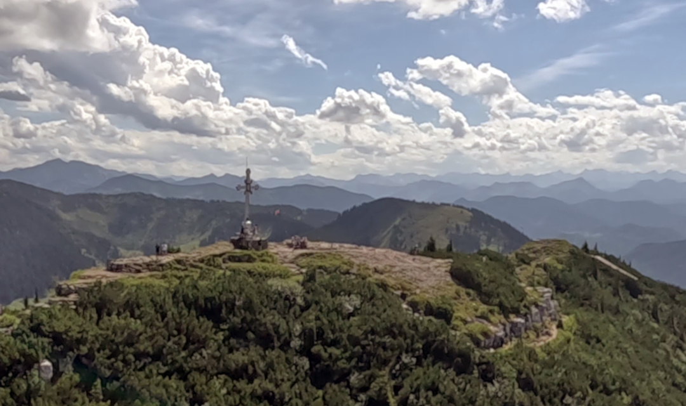

# Previous Version Images

Here are all the version images of previous Where-to-fly versions.

## Current version

Kohlbergspitze, Tyrol, Austria.

## Version 1.16.0

Above Drymades Beach, Dhërmi, Albania.

## Version 1.15.0

Thermalling at Wendelstein, Bavaria, Germany.

## Version 1.14.4

Released on 2024-05-01.

Soaring at Wallberg, Tegernsee, Germany.

## Version 1.14.3

Released on 2024-02-09.

Above Kössen, Unterberghorn, Tyrol, Austria.

## Version 1.14.2

Released on 2023-11-23.

Soaring above Sulzberg, Bavaria, Germany.

## Version 1.14.1

Released on 2023-04-17.

At the Jägerbauernalm takeoff, Schliersee, Bavaria, Germany.

## Version 1.14.0 "New Zealand 2022/2023" edition

Released on 2022-12-01.

Above Lake Wanaka and Roys Peak, South Island, New Zealand.

## Version 1.13.0 "FJällräven Classic 2022" edition

Released on 2022-08-11.

Abisko National Park and Lapporten valley, Lapland, Sweden.

## Version 1.12.0

Released on 2022-07-17.

Hochries takeoff and Chiemsee lake, Bavaria, Germany.

## Version 1.11.0

Released on 2021-11-09.

Above the Kampenwand ridge, Bavaria, Germany.

## Version 1.10.0

Released on 2021-03-14.

View of the Langkofel and Sella group from the Belvedere takeoff.

## Version 1.9.0

Released on 2020-12-21.

View of the Zugspitze, 2962m, above the Höllental valley, Germany

## Version 1.8.1 / 1.8.0 / 1.7.0

Above Roy's Peak, Lake Wanaka, New Zealand

Versions before 1.7.0 had no version images.
