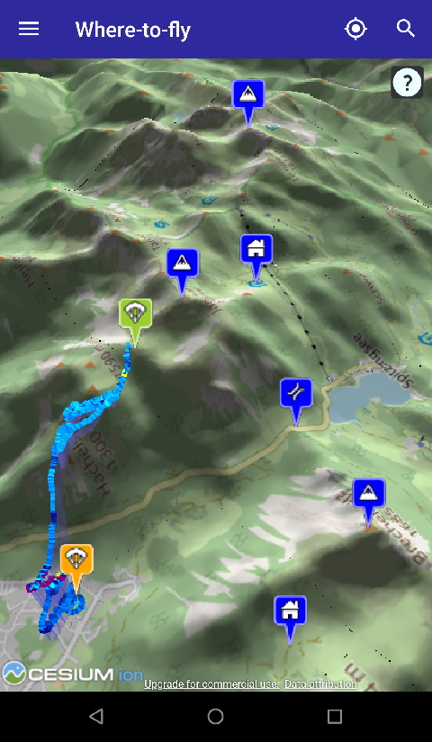

# Where-to-fly

Where-to-fly is an Android app that helps decide where to (hike up and) fly
with a paraglider. It shows the current position on a 3D map, and nearby
point of interests, such as start and landing places, webcams and weather
stations.

See the Changelog for version infos: [Changelog.md](Changelog.md "Changelog")

## Build

Builds are made by Visual Studio AppCenter:

Test versions are available here:
https://install.appcenter.ms/users/michael.fink/apps/wheretofly/distribution_groups/beta%20tester

Builds are occasionally checked with SonarCloud:

## License

Licensed under the [BSD 2-clause license](LICENSE.md).
