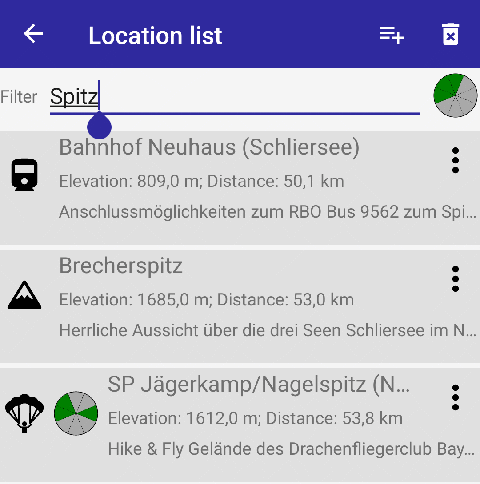
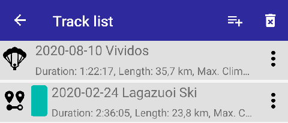
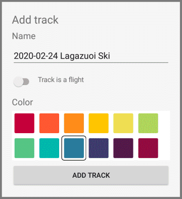
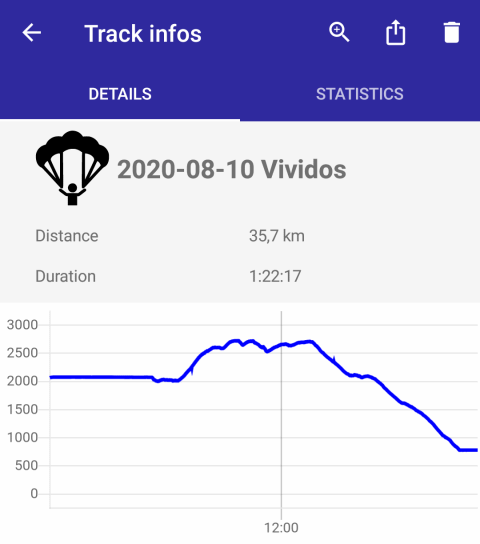
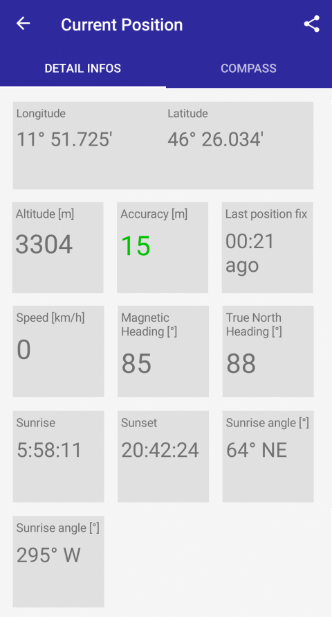
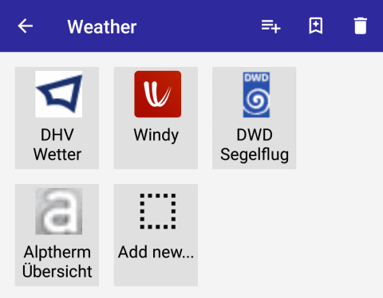
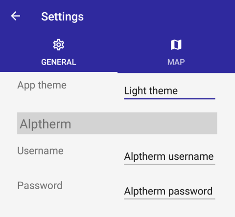
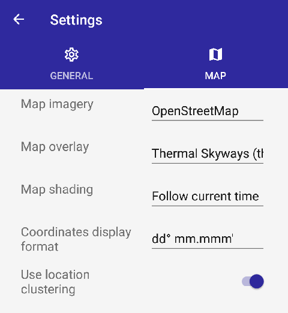

# Manual

Welcome to the manual page for the Where-to-fly app!

##  3D Map

The map view shows a 3D map that visualizes the terrain of the world.
Different imagery layers can be used to show the ground details (in this case
it's OpenStreetMap). The map is shaded according to the sun's current
position, in order to see which slopes may generate better thermals than
others. The map can be moved around using touch controls:

When running on Windows, the map can also be moved around using the mouse:

- Pan the map by clicking on a point and dragging the map.
- Zoom the map using the mouse wheel, or by right-clicking and dragging.
- Tilt the map view by holding the Ctrl key down, right-clicking and dragging.

### Location details

Locations and tracks can be imported and are displayed on the map. Location
pins can be tapped to show detail infos about a location. Here you can see the
details of a summit location:

Depending on the map element, different option icons are displayed. Locations
have the following options:

-  Show details: Opens a page
  with the location's details
-  Set as compass target:
  Sets location as new compass target
-  Navigate here: Starts the navigation
  app to show a route to this location

When the location displays a takeoff, the takeoff directions are shown using
circle sectors:

### Track height profile

When tapping on a track, the height profile of that track is shown in a
semi-transparent window in the lower part of the screen:

The height profile shows the tracks's height. If it's a flight track, the
ground profile is also shown. When tapping the height profile anywhere, or
when hovering or clicking with a mouse, a crosshair line and a tooltip is
shown with extra infos about the current track point. Additionally, a purple
pin is shown in the map at the current track point.

There are several toolbar buttons above the track height profile:

-  Zoom-and-pan: When active
  (white), you can zoom (with a pinch gesture) and pan (with a one-finger
  drag gesture) the height profile.
-  Hover: Fixes the height profile
  dimensions after panning and zooming, in order to explore the height profile
  by hovering over the track points.
-  Reset zoom: Resets
  the zoomed height profile to the full track again.
-  Close: Closes the height profile window.

### Layer objects

Custom layers can be added to the map. The layers can display geometric
objects, such as thermals, national park areas, air spaces or labels. The
layers can be imported from CZML files or OpenAir Airspace text files. When
tapping on a layer object, details for the object are shown:

### Title bar icons

The  button lets you zoom to your current
position, which is marked with a green pin. From the pin info, you can share
your position with other apps.

The  button shows a dialog to find a specific
place, e.g. a mountain or town name. The result is shown with an orange pin.
From the pin info, you can add a new location pin based on the find result.

### Other map functions

A long tap on the map shows the following menu:

- Add new waypoint: Adds a new waypoint location to the location list.
- Set as compass target: Sets the selected point as new compass target.
- Navigate here: Starts the navigation app to show a route to this point.
- Show flying range: Shows a cone at the selected point that visualizes the
  areas that can be reached with a given glide ratio. The following dialog
  appears:

- Glide ratio: Determines how fast you sink; the glide ratio is given in km
  gliding per 1000m sinking.

A half-transparent blue cone appears on the selected point, showing the areas
that are potentially reachable. The details of the cone shows infos about the
flying range. A Hide button lets you hide the cone again.

##  Layers

The app can show layers on the 3D map, e.g. to display thermals, national
park areas or other geographical elements. The Layers view shows the list of
currently loaded custom layers.

The layers list always shows the two default layers "Locations" and "Tracks",
and additionally all loaded layers. Layers can be set invisible with the
 icon.

New layers can be imported with the 
button. A menu is shown to select which kind of layer to import:

- Import CZML Layer: Lets you import .czml files in the Cesium JSON format.
- Import OpenAir airspaces: Lets you import airspaces in the OpenAir text
  format.
- Download from web: Lets you download files to import from the web.

When selecting the first two items, a file picker is opened to select a file
on the device. Allowed file types are CZML and OpenAir text files. The CZML
format is a custom JSON based format from the Cesium project.

The  button removes all layers
(except the two default layers "Locations" and "Tracks", which can't be
removed).

When long-tapping a single layer entry, a context menu appears with the
following menu entries:

-  Zooms to layer object on the map
-  Deletes the selected layer

##  Location list

The location list shows all locations. The list can be filtered using the
entry line. When no location is imported yet, a message is shown that the list
is empty. Tapping on an entry shows the details of that location (see below).

To the right of the filter entry line is the takeoff directions selection
icon. Tapping the icon opens a pop-up dialog that lets you select takeoff
directions that should be used to filter the location list entries. Note that
the app tries to recognize the start directions from the location title or
description text at import.

The  button adds new
locations to the list. First, a selection dialog is shown:

- Import included: The app has some default location lists included. The next
  dialog shows the list of available locations you can choose from.
- Import from storage: Opens a file picker to select a file on the device.
  Allowed file types are KML, KMZ, GPX and CUP.
- Download from web: Presents a list of websites where lists of locations can
  be downloaded from. The selection opens the external website then.

When opening a new list, you can choose to append to the existing list or
replace all existing entries.

Locations can also be added when opening files of supported file types, using
the app (e.g. by tapping on the file or by downloading a file from the web).

When importing KML or KMZ files, only the Placemarks contained in the file are
added as locations. When importing GPX files, only "wpt" waypoints are
imported. CUP files are SeeYou waypoint files, and only waypoints are
imported.

The  button removes all
locations in the list.

When long-tapping a single location entry, a context menu appears with the
following menu entries:

-  Shows details for the selected
  location
-  Zooms to the location on the map
-  Sets location as new
  compass target
-  Deletes the selected location

### Location details

The location details page shows infos about the location, like type, latitude
and longitude and a detail text. When the device currently has a position, the
Distance field contains the current distance to the location.

The following title bar icons are available:

-  Zooms to the location on the map
-  Sets location as new
  compass target
-  Starts the navigation app to
  show a route to this location
-  Shares the location with other apps
-  Deletes the location

### Live waypoints

Some locations can be updated periodically, e.g. for live tracking purposes.
The locations are imported by clicking on weblinks that start with
`where-to-fly://`. The position and other infos of those live waypoints
are updated periodically while the app is running. The live waypoint data is
queried from the Where-to-fly background service. Sources for live waypoints
currently are "Garmin inReach" devices or "Find me Spot" tracker devices.

##  Tracks

The track list shows all currently loaded tracks. Tapping on an entry shows
the details for this track (see below).

The  button adds a new track to
the list. A file picker is opened to select a file on the device. Allowed
file types are KML, KMZ, GPX and IGC. When a file contains multiple tracks, a
selection dialog is shown to choose a specific track.

After the track is loaded, the following dialog appears:

You can edit the track name and determine if the track is a paragliding
flight. Flight tracks are colored based on climb or sink rates. If it's not a
flight, you can select a single color for the track line.

In the rare case that the track has no time points (e.g. for KML LineStrings)
another field "Track point time interval" appears that lets you specify the
time delta between the track points. This is used for correctly calculating
climb and sink rate. Normally, GPS devices record a track point every second.

To adjust the offset of the track point heights, adjust the offset in meters,
by using the "+" and "-" buttons.

For flight tracks, the ground profile is determined after the track was added.
A waiting dialog named "Sampling track points" is shown. Depending on if the
terrain profile is already loaded, this can take some time. The track is
checked if any track point is located below the actual terrain, and the track
is adjusted accordingly.

Tracks can also be added when opening supported file types using the app
(e.g. by tapping on the file or by downloading a file from the web).

The  button removes all
tracks in the list.

When long-tapping a single track entry, a context menu appears with the
following menu entries:

-  Shows details for the selected
  track.
-  Zooms to the track on the map.
-  Deletes the selected track.

### Track infos

The track infos page shows infos about the track. The first tab shows the
track name, track color (if not a flight track), distance, duration and a
height profile. The second tab shows some calculated statistics values.

The following title bar icons are available:

-  Zooms to the track on the map.
-  Exports the track to a GPX file.
-  Deletes the track.

### Track colors

If a track was imported as a flight, the track segments are colored according
to the climb or sink rate of that segment. The following colors are used:

<table border="0px"><tbody>
<tr><th width="50px">Color</th><th>Climb / Sink rate</th></tr>
<tr><td bgcolor="#FF0000"></td><td>+5.0 m/s</td></tr>
<tr><td bgcolor="#FF4000"></td><td>+4.5 m/s</td></tr>
<tr><td bgcolor="#FF8000"></td><td>+4.0 m/s</td></tr>
<tr><td bgcolor="#FFC000"></td><td>+3.5 m/s</td></tr>
<tr><td bgcolor="#FFFF00"></td><td>+3.0 m/s</td></tr>
<tr><td bgcolor="#C0FF00"></td><td>+2.5 m/s</td></tr>
<tr><td bgcolor="#80FF00"></td><td>+2.0 m/s</td></tr>
<tr><td bgcolor="#40FF80"></td><td>+1.5 m/s</td></tr>
<tr><td bgcolor="#00FFFF"></td><td>+1.0 m/s</td></tr>
<tr><td bgcolor="#00E0FF"></td><td>+0.5 m/s</td></tr>
<tr><td bgcolor="#00C0FF"></td><td>0.0 m/s</td></tr>
<tr><td bgcolor="#00A0FF"></td><td>-0.5 m/s</td></tr>
<tr><td bgcolor="#0080FF"></td><td>-1.0 m/s</td></tr>
<tr><td bgcolor="#0060E0"></td><td>-1.5 m/s</td></tr>
<tr><td bgcolor="#0040C0"></td><td>-2.0 m/s</td></tr>
<tr><td bgcolor="#0020A0"></td><td>-3.0 m/s</td></tr>
<tr><td bgcolor="#000080"></td><td>-3.5 m/s</td></tr>
<tr><td bgcolor="#400080"></td><td>-4.0 m/s</td></tr>
</tbody></table>

The colors are interpolated when rates between two colors were calculated.
This can happen for tracks with sub-second track point resolution.

### Live tracks

Live tracking tracks can be updated periodically. The track is imported by
clicking on weblinks that start with `where-to-fly://`. The track data is
updated periodically while the app is running. The live track data is queried
from the Where-to-fly background service.

As soon as a live track is added to the track list, the live tracking toolbar
appears at the bottom of the screen:

The toolbar lets you adjust the time offset of the currently displayed live
track point. Naturally, live track data is transferred with a delay, so the
current position can only be displayed in the past. The time offset slider
sets the difference. The  button
resets the time offset to -3 minutes.

##  Current position

The current position page has two tabs: Detail Infos and Compass.

### Detail Infos

The detail infos tab page shows the coordinates and other infos about the
current position. If available, the magnetic compass direction is show. In
addition, the true-north direction, determined by the compass and the current
location is shown, or the heading from the GPS device is used. The sunrise and
sunset times are calculated from the current longitude and latitude.

The position data can be shared with other apps using the
 share button.

### Compass

The compass tab page shows a compass with the cardinal directions, and when
the current position is available, the sunrise and sunset. As soon as a
location or position on the map is selected as "compass target", the compass
also shows the direction to this position. Below, the magnetic and true-north
heading is displayed, as well as distance and height difference to the
selected compass target.

The following title bar buttons are available:

-  Set compass direction:
  Lets you select a compass direction without a specific target location, e.g
  to determine landmarks from your current position and then checking the map.
  The following dialog appears to select the compass target direction:

##  Weather

The weather page lets you quickly choose and view weather related pages, such
as forecast and current weather websites, or webcam pages. The app contains a
fixed list of different websites that can be added to the dashboard by tapping
on the  "Add new..." tile or by
using the  button.

The  button lets you add new
web links not included in the app. The following dialog appears to add the
link:

### Weather browser

When a weather dashboard tile was tapped, the corresponding weather website is
loaded and shown. The following buttons are available in this page:

-  Reloads the current page, e.g. to update the
  weather infos.
-  Shows a list of forecast
  websites to visit next.
-  Shows a list
  of current weather websites.
-  Shows a list of webcam websites.

Any images in the browser can be saved to the device by long-tapping the
image. A menu appears to confirm the download.

##  Settings

The settings page shows two tabs, the general tab and the map tab.

###  General tab

The General tab lets you specify the following settings.

#### App Theme

Specifies the app color theme that should be used. The following
options are available:

- Same as device: Uses the theme of the device. Android 9 and later, and
  Windows 10 version 1803 and later support switching to dark mode. On earlier
  devices, light theme is automatically used.
- Light theme: Shows the user interface in a light theme, with light
  backgrounds and dark or black text and controls.
- Dark theme: Shows the user interface in a dark theme. This is easier to read
  when it's dark outside. It also saves battery with OLED screens.

The default setting is "Same as device". When the device switches themes
automatically (e.g. dark theme in the evening), then the app also switches the
theme automatically.

#### Alptherm

Lets you enter username/passwort of an account for the Alptherm weather
service. When opening one of the Alptherm links, the app automatically logs
you in if necessary. The password is stored using
[secure storage](https://docs.microsoft.com/en-us/xamarin/essentials/secure-storage?tabs=android).

###  Map tab

The Map tab has several settings:

- Map Imagery: Determines the base imagery layer. The following layers are
  available:
  * OpenStreetMap: Tiles from the well known mapping project.
  * Aerials + Labels (Bing Maps): Bing maps tiles, showing aerial photography
    and labels.
  * Sentinel-2 Cloudless: Tiles showing terrain from Sentinel-2 satellite
    imagery.
  * OpenTopoMap: Tiles showing topographical maps, from the open source
    project [opentopomap.org](https://opentopomap.org/).
  * OpenFlightMaps: Tiles showing flight related infos like airspaces, etc.,
    from the project [openflightmaps.org](https://www.openflightmaps.org/).

- Map Overlay: Shows a second half-transparent layer over the imagery layer:
  * None: No second layer.
  * Thermal Skyways (thermal.kk7.ch): Displays thermal skyways from
    [thermal.kk7.ch](https://thermal.kk7.ch).
  * Contour lines: Displays contour lines with a distance of 100 meters.
  * Slope + contour lines: Displays contour lines and additionally colors the
    ground based on the slope.
  * NASA Black Marble 2017: Displays the night imagery from NASA.

- Map Shading: Determines how the map is shaded, based on the sun's position:
  * Fixed at 10 am: The sunlight shines on early SE slopes.
  * Fixed at 3 pm: The sunlight shines on afternooon SW slopes.
  * Follow current time: The sunlight follows the current time.
  * Current time + 6 hours: The sun is positioned 6 hours into the future.
  * No shading: No shading from sunlight.

- Coordinates display format: Determines how latitude and longitude are
  displayed in the app:
  * dd.dddddd&deg;
  * dd&deg; mm.mmm'
  * dd&deg; mm' sss"

- Use location clustering: When activiated, location pins are clustered into
  red "placeholder" pins when zooming out. The pins show how many actual
  loations are clustered. This helps when many location pins are placed in one
  small region.
